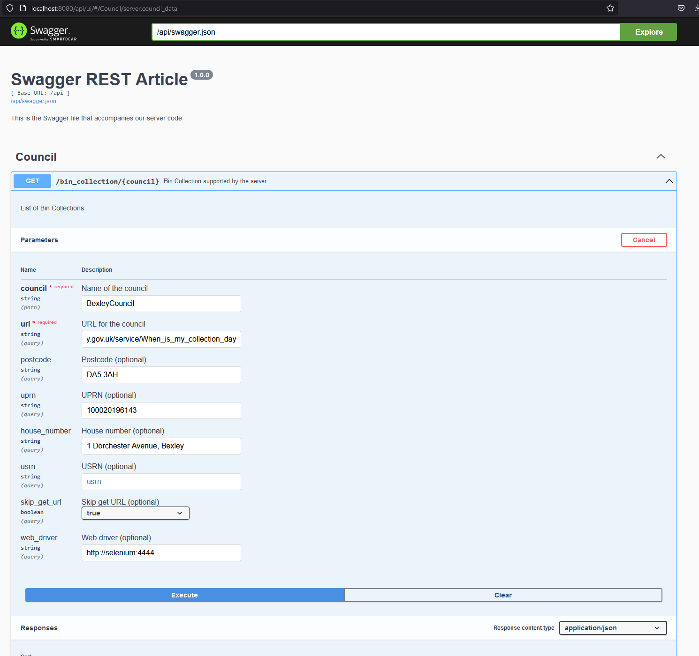

[](https://www.python.org)

[](https://github.com/robbrad/UKBinCollectionData)
[](https://github.com/robbrad/UKBinCollectionData/releases)
[](https://pypi.org/project/uk-bin-collection/)

[](https://github.com/robbrad/UKBinCollectionData/blob/master/LICENSE)
[](https://github.com/robbrad/UKBinCollectionData/issues?q=is%3Aopen+is%3Aissue)
[](https://github.com/robbrad/UKBinCollectionData/issues?q=is%3Aissue+is%3Aclosed)
[](https://github.com/robbrad/UKBinCollectionData/graphs/contributors)

[](https://github.com/robbrad/UKBinCollectionData/actions/workflows/behave.yml)

[](https://github.com/robbrad/UKBinCollectionData/actions/workflows/codeql-analysis.yml)
[](https://github.com/robbrad/UKBinCollectionData/actions/workflows/release.yml)
[](https://github.com/robbrad/UKBinCollectionData/actions/workflows/pages/pages-build-deployment)

# UK Bin Collection Data (UKBCD)
This project aims to provide a neat and standard way of providing bin collection data in JSON format from UK councils that have no API to do so.

Why do this?
You might want to use this in a Home Automation - for example say you had an LED bar that lit up on the day of bin collection to the colour of the bin you want to take out, then this repo provides the data for that. 

**PLEASE respect a councils infrastructure / usage policy and only collect data for your own personal use on a suitable frequency to your collection schedule.**

Most scripts make use of [Beautiful Soup 4](https://pypi.org/project/beautifulsoup4/) to scrape data, although others use different approaches, such as emulating web browser behaviour, or reading data from CSV files.

[](https://community.home-assistant.io/t/bin-waste-collection/55451)
[](https://github.com/robbrad/UKBinCollectionData/issues/new/choose)

---

## Home Assistant Usage

### Install with HACS (recommended)

#### Automated
[](https://github.com/hacs/integration)

This integration can be installed directly via HACS. To install:

* [Add the repository](https://my.home-assistant.io/redirect/hacs_repository/?owner=robbrad&repository=UKBinCollectionData&category=integration) to your HACS installation
* Click `Download`

#### Manual
1. Ensure you have [HACS](https://hacs.xyz/) installed
1. In the Home Assistant UI go to `HACS` > `Integrations` > `⋮` > `Custom repositories`.
1. Enter `https://github.com/robbrad/UKBinCollectionData` in the `Repository` field.
1. Select `Integration` as the category then click `ADD`.
1. Click `+ Add Integration` and search for and select `UK Bin Collection Data` then click `Download`.
1. Restart your Home Assistant.
1. In the Home Assistant UI go to `Settings` > `Devices & Services` click `+ Add Integration` and search for `UK Bin Collection Data`.
1. If your see a "URL of the remote Selenium web driver to use" field when setting up your council, you'll need to provide the URL to a web driver you've set up seperately such as [standalone-chrome](https://hub.docker.com/r/selenium/standalone-chrome).

### Install manually

1. Open the folder for your Home Assistant configuration (where you find `configuration.yaml`).
1. If you do not have a `custom_components` folder there, you need to create it.
1. [Download](https://github.com/robbrad/UKBinCollectionData/archive/refs/heads/master.zip) this repository then copy the folder `custom_components/uk_bin_collection` into the `custom_components` folder you found/created in the previous step.
1. Restart your Home Assistant.
1. In the Home Assistant UI go to `Settings` > `Devices & Services` click `+ Add Integration` and search for `UK Bin Collection Data`.

---

## Standalone Usage
```commandline
PS G:\Projects\Python\UKBinCollectionData\uk_bin_collection\collect_data.py
usage: collect_data.py [-h] [-p POSTCODE] [-n NUMBER] [-u UPRN] module URL

positional arguments:
  module                Name of council module to use                           (required)
  URL                   URL to parse                                            (required)

options:
  -h, --help                            show this help message                  (optional)
  -p POSTCODE, --postcode POSTCODE      Postcode to parse - should include      (optional)
                                        a space and be wrapped in double
                                        quotes                                  
  -n NUMBER, --number NUMBER            House number to parse                   (optional)
  -u UPRN, --uprn UPRN                  UPRN to parse                           (optional)
```

### Quickstart
The basic command to execute a script is:
```commandline
python collect_data.py <council_name> "<collection_url>"
```
where ```council_name``` is the name of the council's .py script (without the .py) and ```collection_url``` is the URL to scrape.
The help documentation refers to these as "module" and "URL", respectively. Supported council scripts can be found in the `uk_bin_collection/uk_bin_collection/councils` folder.

Some scripts require additional parameters, for example, when a UPRN is not passed in a URL, or when the script is not scraping a web page.
For example, the Leeds City Council script needs two additional parameters - a postcode, and a house number. This is done like so:

```commandline
python collect_data.py LeedsCityCouncil https://www.leeds.gov.uk/residents/bins-and-recycling/check-your-bin-day -p "LS1 2JG" -n 41
```
- A **postcode** can be passed with `-p "postcode"` or `--postcode "postcode"`. The postcode must always include a space in the middle and
be wrapped in double quotes (due to how command line arguments are handled).
- A **house number** can be passed with `-n number` or `--number number`.
- A **UPRN reference** can be passed with `-u uprn` or `--uprn uprn`.

To check the parameters needed for your council's script, please check the [project wiki](https://github.com/robbrad/UKBinCollectionData/wiki) for more information.


### Project dependencies
Some scripts rely on external packages to function. A list of required scripts for both development and execution can be found in the project's [PROJECT_TOML](https://github.com/robbrad/UKBinCollectionData/blob/feature/%2353_integration_tests/pyproject.toml) 
Install can be done via 
`poetry install` from within the root of the repo.

---

## UPRN Finder
Some councils make use of the UPRN (Unique property reference number) to identify your property. You can find yours [here](https://www.findmyaddress.co.uk/search) or [here](https://uprn.uk/).

---
## Selenium
Some councils need Selenium to run the scrape on behalf of Home Assistant. The easiest way to do this is run Selenium as in a Docker container. However you do this the Home Assistant server must be able to reach the Selenium server

### Instructions for Windows, Linux, and Mac

#### Step 1: Install Docker

##### Windows

1.  **Download Docker Desktop for Windows:**
    
    *   Go to the Docker website: Docker Desktop for Windows
    *   Download and install Docker Desktop.
2.  **Run Docker Desktop:**
    
    *   After installation, run Docker Desktop.
    *   Follow the on-screen instructions to complete the setup.
    *   Ensure Docker is running by checking the Docker icon in the system tray.

##### Linux

1.  **Install Docker:**
    
    *   Open a terminal and run the following commands:
                       
        ```bash
        sudo apt-get update
        sudo apt-get install \
            apt-transport-https \
            ca-certificates \
            curl \
            gnupg \
            lsb-release
        curl -fsSL https://download.docker.com/linux/ubuntu/gpg | sudo gpg --dearmor -o /usr/share/keyrings/docker-archive-keyring.gpg
        echo \
          "deb [arch=$(dpkg --print-architecture) signed-by=/usr/share/keyrings/docker-archive-keyring.gpg] https://download.docker.com/linux/ubuntu \
          $(lsb_release -cs) stable" | sudo tee /etc/apt/sources.list.d/docker.list > /dev/null
        sudo apt-get update
        sudo apt-get install docker-ce docker-ce-cli containerd.io 
        ```
        
2.  **Start Docker:**
    
    *   Run the following command to start Docker:
                        
        ```bash
        sudo systemctl start docker
        ```
        
3.  **Enable Docker to start on boot:**
    
    bash
    
    Copy code
    
    ```bash
    sudo systemctl enable docker
    ```
    

##### Mac

1.  **Download Docker Desktop for Mac:**
    
    *   Go to the Docker website: Docker Desktop for Mac
    *   Download and install Docker Desktop.
2.  **Run Docker Desktop:**
    
    *   After installation, run Docker Desktop.
    *   Follow the on-screen instructions to complete the setup.
    *   Ensure Docker is running by checking the Docker icon in the menu bar.

#### Step 2: Pull and Run Selenium Standalone Chrome Docker Image

1.  **Open a terminal or command prompt:**
    
2.  **Pull the Selenium Standalone Chrome image:**
       
    ```bash
    docker pull selenium/standalone-chrome
    ```
    
4.  **Run the Selenium Standalone Chrome container:**
        
    ```bash
    docker run -d -p 4444:4444 --name selenium-chrome selenium/standalone-chrome
    ```
    

#### Step 3: Test the Selenium Server

1.  **Navigate to the Selenium server URL in your web browser:**
    *   Open a web browser and go to `http://localhost:4444`
    *   You should see the Selenium Grid console.

#### Step 4: Supply the Selenium Server URL to UKBinCollectionData

1.  **Find the `UKBinCollectionData` project:**
    
    *   Go to the GitHub repository: [UKBinCollectionData](https://github.com/robbrad/UKBinCollectionData)
2.  **Supply the Selenium Server URL:**
    
    *   Typically, the URL will be `http://localhost:4444/wd/hub`
    *   You might need to update a configuration file or environment variable in the project to use this URL. Check the project's documentation for specific instructions.

### Summary of Commands

**Windows/Linux/Mac:**

```bash
docker pull selenium/standalone-chrome docker run -d -p 4444:4444 --name selenium-chrome selenium/standalone-chrome
```

**Selenium Server URL:**

*   `http://localhost:4444/wd/hub`

---

## Requesting your council
To make a request for your council, first check the [Issues](https://github.com/robbrad/UKBinCollectionData/issues) page to make sure it has not already been requested. If not, please fill in a new [Council Request](https://github.com/robbrad/UKBinCollectionData/issues/new/choose) form, including as much information as possible, including:
- Name of the council
- URL to bin collections
- An example postcode and/or UPRN (whichever is relevant)
- Any further information

Please be aware that this project is run by volunteer contributors and completion depends on numerous factors - even with a request, we cannot guarantee if/when your council will get a script.

---

## Reports

- [3.11](https://robbrad.github.io/UKBinCollectionData/3.11/)
- [3.12](https://robbrad.github.io/UKBinCollectionData/3.12/)

---
## Docker API Server
We have created an API for this located under [uk_bin_collection_api_server](https://github.com/robbrad/UKBinCollectionData/uk_bin_collection_api_server)

### Prerequisites

- Docker installed on your machine
- Python (if you plan to run the API locally without Docker)

### Running the API with Docker

1. Clone this repository.
2. Navigate to the uk_bin_collection_api_server directory of the project.

#### Build the Docker Container

```bash
docker build -t ukbc_api_server .
```

```
docker run -p 8080:8080 ukbc_api_server
```

#### Accessing the API

Once the Docker container is running, you can access the API endpoints:

    API Base URL: http://localhost:8080/api
    Swagger UI: http://localhost:8080/api/ui/

#### API Documentation

The API documentation can be accessed via the Swagger UI. Use the Swagger UI to explore available endpoints, test different requests, and understand the API functionalities.



#### API Endpoints
`GET /bin_collection/{council}`

Description: Retrieves information about bin collection for the specified council.

Parameters:

    council (required): Name of the council.
    Other optional parameters: [Specify optional parameters if any]

Example Request:

```bash
curl -X GET "http://localhost:8080/api/bin_collection/{council}" -H "accept: application/json"
```

## Docker Compose
This includes the Selenium standalone-chrome for Selenium based councils

```
version: '3'

services:
  ukbc_api_server:
    build:
      context: .
      dockerfile: Dockerfile 
    ports:
      - "8080:8080"  # Adjust the ports as needed
    depends_on:
      - selenium

  selenium:
    image: selenium/standalone-chrome:latest
    ports:
      - "4444:4444"

```
### Run with
```bash
sudo apt-get update
sudo apt-get install docker-compose

docker-compose up
```

---

## FAQ
#### I've got an issue/support question - what do I do?
Please post in the [HomeAssistant thread](https://community.home-assistant.io/t/bin-waste-collection/55451) or raise a new (non council request) [issue](https://github.com/robbrad/UKBinCollectionData/issues/new).

#### I'd like to contribute, where do I start?
Contributions are always welcome! See ```CONTRIBUTING.md``` to get started. Please adhere to the project's [code of conduct](https://github.com/robbrad/UKBinCollectionData/blob/master/CODE_OF_CONDUCT.md).

- If you're new to coding/Python/BeautifulSoup, feel free to check [here](https://github.com/robbrad/UKBinCollectionData/issues?q=is%3Aissue+is%3Aopen+label%3A%22good+first+issue%22) for issues that are good for newcomers!
- If you would like to try writing your own scraper, feel free to fork this project and use existing scrapers as a base for your approach (or `councilclasstemplate.py`).

## Contributors
<a href="https://github.com/robbrad/UKBinCollectionData/graphs/contributors">
  
</a>
